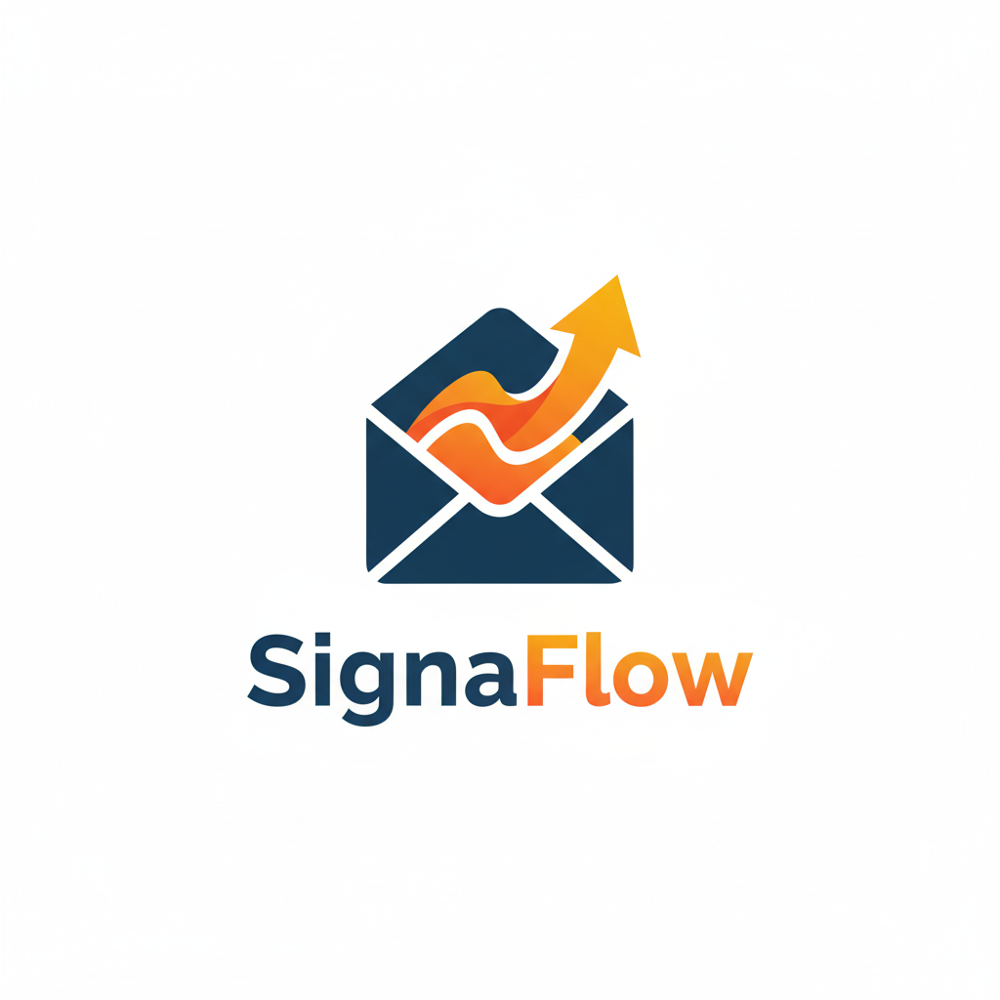

# 📧 SignaFlow - Email Signature Management Platform

<p align="center">
  <a href="https://github.com/aethrox/signaflow/docs/signaflow_intro.md">
    
  </a>
</p>

> **⚠️ PROJECT STATUS: DISCONTINUED (Oct 18, 2025)**
> 
> **Why I Stopped:** Spent 14 days building this before discovering Gmail/Outlook don't allow automated signature installation. Even $50/month competitors like WiseStamp and Exclaimer can't do this - they all use browser extensions instead 😅
> 
> **What Works:** Complete frontend + working N8N signature generation API
> 
> **What Doesn't:** The whole automation part (which was... the entire point)
> 
> **Biggest Lesson:** Always validate your core technical assumptions on Day 1, not Day 14 💡

---

## 💡 The Original Idea

I noticed companies with 50+ employees had a real problem: keeping everyone's email signatures consistent and up-to-date was a nightmare 😰

**My Solution:** Build a centralized dashboard where HR can:
- Manage all employee signatures from one place ✅
- Update everyone's signature instantly 🔄
- Add campaign banners for promotions 🎯
- Handle GDPR compliance automatically ⚖️

**Reality Check:** Email clients intentionally block this for security reasons. Can't blame them - they're protecting users from phishing attacks 🛡️

---

## 🛠️ Tech Stack

- **Frontend:** React + TypeScript + Tailwind CSS
- **Backend:** N8N Workflows (webhook-based API)
- **Database:** Supabase (planned, never connected)
- **Deployment:** Never made it there 😅

---

## ✅ What I Actually Built

### Completed Features:
- ✅ **Dashboard** with analytics and metrics
- ✅ **Employee Management** (add, edit, delete, bulk actions)
- ✅ **3 Signature Templates** (Professional, Minimal, Modern)
- ✅ **Campaign Banner System** with scheduling
- ✅ **Settings Pages** (company info, GDPR text)
- ✅ **Fully Responsive** mobile UI
- ✅ **N8N Workflow** with 11 nodes generating HTML signatures
- ✅ **Form Validation** and error handling

### What Didn't Get Built:
- ❌ **Automated Installation** (technically impossible)
- ❌ **Database Integration** (Supabase sitting there unused)
- ❌ **User Authentication** (no backend = no auth)
- ❌ **Real Deployment** (what's the point without automation?)

---

## 🚀 How to Run This

```bash
# Clone it
git clone https://github.com/aethrox/signaflow
cd signaflow

# Install stuff
npm install

# Setup N8N webhook URL
echo "VITE_N8N_WEBHOOK_URL=http://localhost:5678/webhook/generate-signature" > .env

# Run it
npm run dev
```

**Note:** The N8N workflow actually works! Check `/docs/n8n-workflow-guide.md` for the complete 11-node setup.

---

## 📂 Project Structure

```
signaflow/
├── src/
│   ├── components/
│   │   └── pages/               # All the UI pages 🎨
│   ├── services/
│   │   └── signatureApi.ts      # N8N webhook calls 📡
│   └── utils/
│       └── signatureGenerator.ts # Mock generator for frontend 🔧
├── docs/
│   ├── signaflow-intro.md       # Business plan (RIP) 💼
│   ├── signaflow-api-docs.md    # API specs 📋
│   ├── n8n-workflow-guide.md    # Actually useful! ✨
│   └── signaflow-deployment.md  # Never used 😢
└── README.md                    # You are here 👋
```

---

## 🏗️ Architecture (As It Stands)

```
React Frontend → N8N Webhook API → HTML Signature → Manual Copy/Paste
   (Mock Data)                                         (Not Automated)
       ↓
  Supabase Database
  (Never Connected)
```

---

## 🤔 What Went Wrong

### The Fatal Flaw
Gmail and Outlook **intentionally** block third-party apps from installing signatures. This isn't a bug I could fix - it's a security feature 🔒

### How I Realized
After building 90% of the app, I finally tested the Gmail API. Turns out there's literally no endpoint for signature installation. Checked Outlook - same story 😭

### What Competitors Actually Do
WiseStamp, Exclaimer? They use **browser extensions**. Not SaaS platforms. Their marketing makes it look like magic, but they're working around the same limitations.

---

## 💭 What I Learned

### 1. **Validate First, Build Second** 🎯
Should have spent Day 1 testing Gmail/Outlook APIs, not designing the UI.

### 2. **Read Between Marketing Lines** 📢
"Automated signature management" sounds great until you realize everyone needs a browser extension.

### 3. **Know When to Quit** 🛑
90% complete ≠ viable product. Without automation, this is just a fancy signature designer.

### 4. **Mock Data Lies** 🎭
Everything worked perfectly with fake data. Real integration would've shown problems earlier.

### 5. **Security Is Not Negotiable** 🔐
Email clients restrict signatures to prevent phishing. That's actually a good thing.

---

## 🔮 What Could Have Worked Instead

### Option 1: Outlook-Only Version 📧
Microsoft Graph API has *slightly* better access. Could target enterprise Outlook users exclusively.

### Option 2: Browser Extension 🔌
Follow WiseStamp's model. Different tech stack, different distribution challenges.

### Option 3: Different Problem 🎨
Pivot to newsletter templates or marketing emails - no signature installation headaches.

### Option 4: Design Tool 🖌️
Drop the automation promise. Become "Canva for email signatures" with manual copy/paste.

---

## 📊 By The Numbers

| Metric | Value |
|--------|-------|
| **Dev Time** ⏱️ | 14 days (Oct 4-18, 2025) |
| **React Components** ⚛️ | 40+ |
| **Lines of Code** 💻 | ~8,000 |
| **Features Done** ✅ | 90% |
| **Actually Deployed** 🚀 | 0% |
| **Money Made** 💰 | $0 (obviously) |
| **Lessons Learned** 🎓 | Priceless |

---

## 🧪 The N8N Part That Actually Works

**What It Does:** Generates HTML email signatures via webhook

**How It Works:**
1. Receives employee data (name, email, position, etc.)
2. Picks template style (Professional/Modern/Minimal)
3. Injects campaign banner if active
4. Adds GDPR compliance text
5. Returns formatted HTML + plain text version

**Test It:**
```bash
curl -X POST http://localhost:5678/webhook/generate-signature \
  -H "Content-Type: application/json" \
  -d '{
    "employee": {
      "firstName": "John",
      "lastName": "Doe",
      "email": "john@company.com",
      "position": "Software Engineer"
    },
    "template": { "id": "professional" },
    "company": { "name": "Acme Corp", "brandColor": "#4F46E5" }
  }'
```

Full workflow setup: `/docs/n8n-workflow-guide.md`

---

## 💼 The Business Plan (That Never Was)

**Target Market:** Companies with 50-500 employees  
**Pricing:**
- Starter: $50/mo (50 users)
- Growth: $150/mo (200 users)
- Enterprise: Custom

**Competitors:**
- WiseStamp: $6-15/user/mo + extension
- Exclaimer: $200-500/mo, Outlook only
- MySignature: $8/mo, manual workflow

**Turkish Market:** ~5,000 potential companies

**Problem:** Market exists, solution was impossible 😅

---

## 📄 Documentation

| File | What's Inside |
|------|---------------|
| [`signaflow-intro.md`](./docs/signaflow-intro.md) | Business plan & market research 📊 |
| [`signaflow-api-docs.md`](./docs/signaflow-api-docs.md) | API specs (never implemented) 📝 |
| [`n8n-workflow-guide.md`](./docs/n8n-workflow-guide.md) | **Actually useful!** Working N8N setup 🔧 |
| [`signaflow-deployment.md`](./docs/signaflow-deployment.md) | Deployment checklist (unused) 📋 |

---

## 🙏 Thanks To

**Technologies:**
- React + TypeScript (solid as always)
- Tailwind CSS (made it look good fast)
- N8N (the only part that actually shipped)
- Lucide Icons (pretty icons)

**Inspiration:**
- WiseStamp (for showing what *looks* like magic)
- Exclaimer (for the enterprise angle)
- Gmail API Docs (for crushing my dreams)

---

## 📜 License

MIT - Do whatever you want with this code. Just remember: the core feature doesn't work 😉

---

**Built:** Oct 4-18, 2025  
**Status:** Learning Experience™  
**Lesson:** Validate your assumptions before writing 8,000 lines of code  

---

*"The best way to learn what doesn't work is to build it anyway."* 🎓✨
