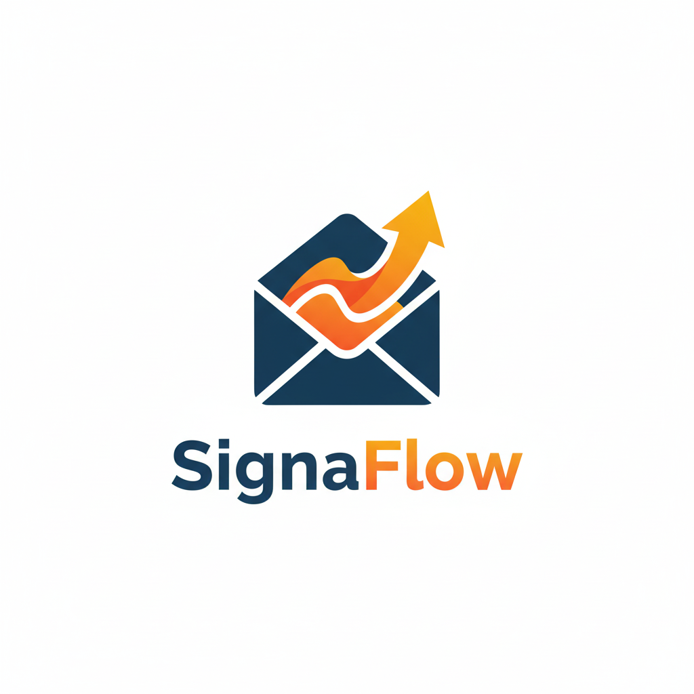

# SignaFlow: Email Signature Management Platform

<p align="center">
  
</p>

> **Project status: discontinued (Oct 18, 2025).**
>
> **Why I stopped:** spent 14 days building this before discovering Gmail/Outlook don't allow automated signature installation. Even $50/month competitors like WiseStamp and Exclaimer can't do this either; they all rely on browser extensions instead.
>
> **What works:** the complete frontend, plus a working N8N signature-generation API.
>
> **What doesn't:** the whole automation part, which was the entire point.
>
> **Biggest lesson:** validate your core technical assumptions on Day 1, not Day 14.

## The Original Idea

Companies with 50+ employees have a real problem: keeping everyone's email signature consistent and up to date is a nightmare. The plan was a centralized dashboard where HR could manage all employee signatures from one place, push updates instantly, add campaign banners, and handle GDPR compliance automatically.

**Reality check:** email clients intentionally block this for security reasons, to protect users from phishing. Fair enough, but it kills the product.

## Tech Stack

- **Frontend:** React + TypeScript + Tailwind CSS
- **Backend:** N8N workflows (webhook-based API)
- **Database:** Supabase (planned, never connected)
- **Deployment:** never happened

## What Actually Got Built

**Completed:**
- Dashboard with analytics and metrics
- Employee management (add, edit, delete, bulk actions)
- 3 signature templates (Professional, Minimal, Modern)
- Campaign banner system with scheduling
- Settings pages (company info, GDPR text)
- Fully responsive mobile UI
- N8N workflow with 11 nodes generating HTML signatures
- Form validation and error handling

**Not built:**
- Automated installation (technically impossible)
- Database integration (Supabase sitting there unused)
- User authentication (no backend, so no auth)
- Real deployment (no point without automation)

## Quick Start

```bash
git clone https://github.com/aethrox/signaflow
cd signaflow
npm install
echo "VITE_N8N_WEBHOOK_URL=http://localhost:5678/webhook/generate-signature" > .env
npm run dev
```

The N8N workflow actually works. See `/docs/n8n-workflow-guide.md` for the complete 11-node setup.

## Project Structure

```
signaflow/
├── src/
│   ├── components/
│   │   └── pages/                # all UI pages
│   ├── services/
│   │   └── signatureApi.ts       # N8N webhook calls
│   └── utils/
│       └── signatureGenerator.ts # mock generator for the frontend
├── docs/
│   ├── signaflow-intro.md        # business plan
│   ├── signaflow-api-docs.md     # API specs
│   ├── n8n-workflow-guide.md     # the part that actually works
│   └── signaflow-deployment.md   # never used
└── README.md
```

## Architecture As It Stands

```
React frontend (mock data) -> N8N webhook API -> HTML signature -> manual copy/paste (not automated)
                                     |
                              Supabase database (never connected)
```

## What Went Wrong

**The fatal flaw:** Gmail and Outlook intentionally block third-party apps from installing signatures. Not a bug to fix, a security feature.

**How I found out:** after building 90% of the app, I finally tested the Gmail API. There's no endpoint for signature installation. Outlook: same story.

**What competitors actually do:** WiseStamp and Exclaimer use browser extensions, not SaaS platforms. Their marketing makes it look like magic, but they're working around the same limitation.

## What I Learned

1. **Validate first, build second.** Day 1 should have been spent testing Gmail/Outlook APIs, not designing the UI.
2. **Read between marketing lines.** "Automated signature management" sounds great until you realize everyone needs a browser extension.
3. **Know when to quit.** 90% complete does not equal a viable product. Without automation, this is just a signature designer.
4. **Mock data lies.** Everything worked perfectly with fake data; real integration would have surfaced the problem much earlier.
5. **Security is not negotiable.** Email clients restrict signatures to prevent phishing, and that's a good thing.

## What Could Have Worked Instead

- **Outlook-only version:** Microsoft Graph API has slightly better access; could target enterprise Outlook users exclusively.
- **Browser extension:** follow WiseStamp's model. Different tech stack, different distribution challenges.
- **Different problem:** pivot to newsletter or marketing-email templates, no signature-installation headache.
- **Design tool:** drop the automation promise and become a "Canva for email signatures" with manual copy/paste.

## By the Numbers

| Metric | Value |
|---|---|
| Dev time | 14 days (Oct 4-18, 2025) |
| React components | 40+ |
| Lines of code | ~8,000 |
| Features done | 90% |
| Actually deployed | 0% |
| Money made | $0 |

## The N8N Part That Actually Works

Generates HTML email signatures via webhook: receives employee data (name, email, position, etc.), picks a template style, injects a campaign banner if active, adds GDPR compliance text, and returns formatted HTML plus a plain-text version.

Test it:

```bash
curl -X POST http://localhost:5678/webhook/generate-signature \
  -H "Content-Type: application/json" \
  -d '{
    "employee": {
      "firstName": "John",
      "lastName": "Doe",
      "email": "john@company.com",
      "position": "Software Engineer"
    },
    "template": { "id": "professional" },
    "company": { "name": "Acme Corp", "brandColor": "#4F46E5" }
  }'
```

Full workflow setup: `/docs/n8n-workflow-guide.md`.

## The Business Plan That Never Was

**Target market:** companies with 50-500 employees.

**Pricing:** Starter $50/mo (50 users), Growth $150/mo (200 users), Enterprise custom.

**Competitors:** WiseStamp ($6-15/user/mo + extension), Exclaimer ($200-500/mo, Outlook only), MySignature ($8/mo, manual workflow).

**Target market size:** ~5,000 potential companies in Turkey.

The market exists; the solution was impossible.

## Documentation

| File | What's inside |
|---|---|
| [`signaflow-intro.md`](./docs/signaflow-intro.md) | business plan and market research |
| [`signaflow-api-docs.md`](./docs/signaflow-api-docs.md) | API specs (never implemented) |
| [`n8n-workflow-guide.md`](./docs/n8n-workflow-guide.md) | working N8N setup, the part that shipped |
| [`signaflow-deployment.md`](./docs/signaflow-deployment.md) | deployment checklist (unused) |

## Limitations

- No automated signature installation, which was the entire point of the product; email clients block it by design.
- No database integration: Supabase is configured but never connected, so nothing persists past a page refresh.
- No authentication, since there's no backend to authenticate against.
- Never deployed; this only ever ran locally.

## License

MIT. Do whatever you want with this code, just remember the core feature doesn't work.

---

**Built:** Oct 4-18, 2025. **Lesson:** validate your assumptions before writing 8,000 lines of code.
